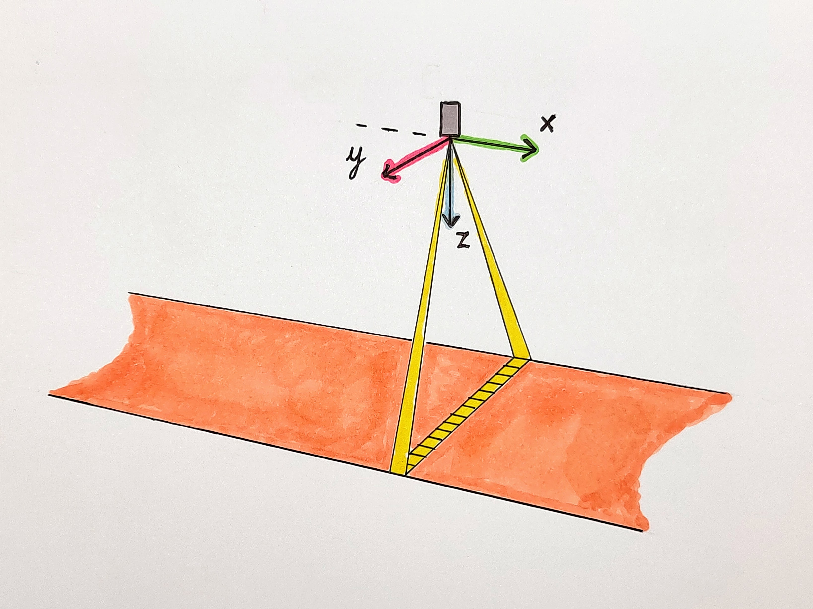
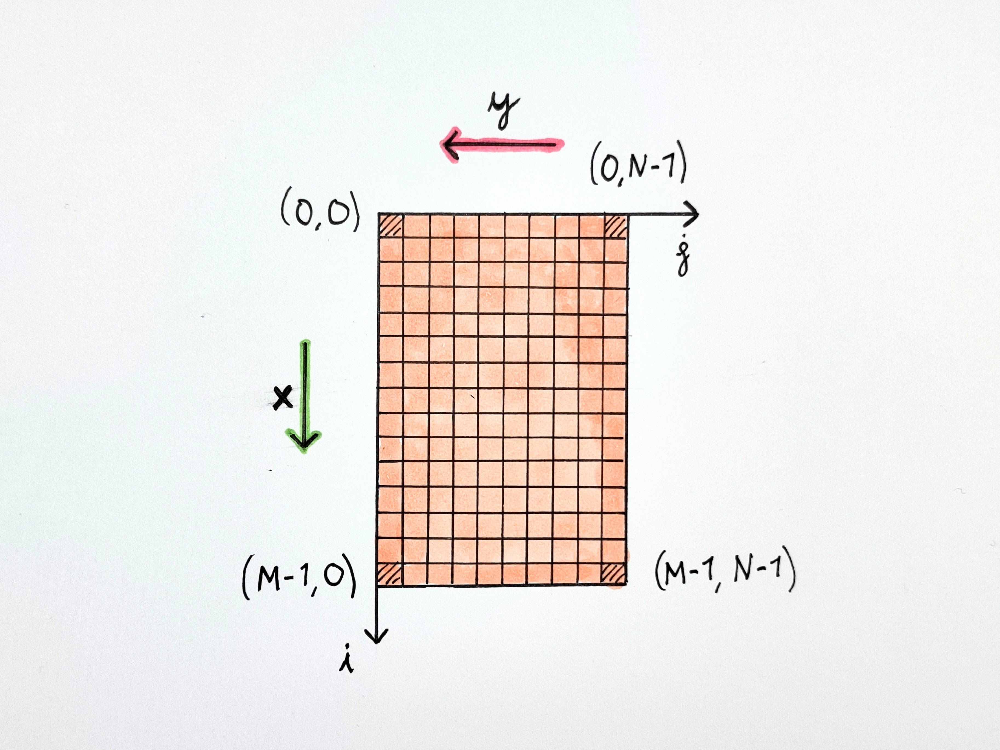
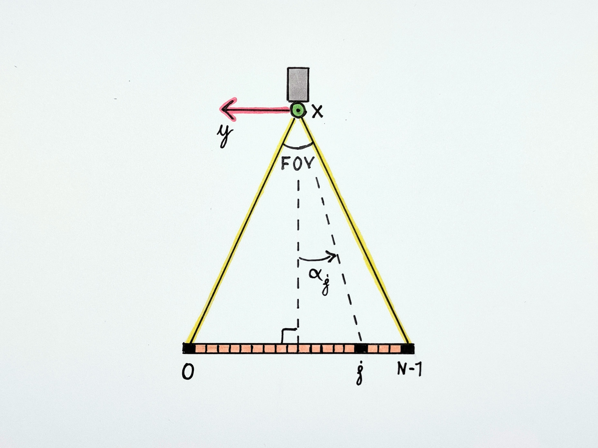
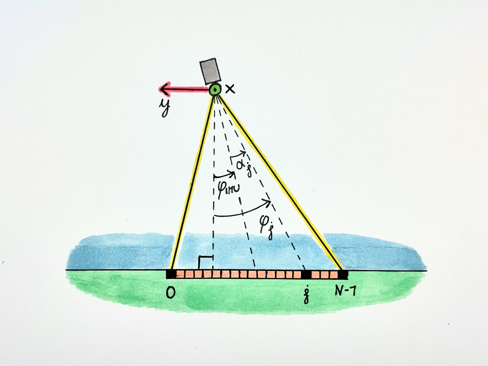
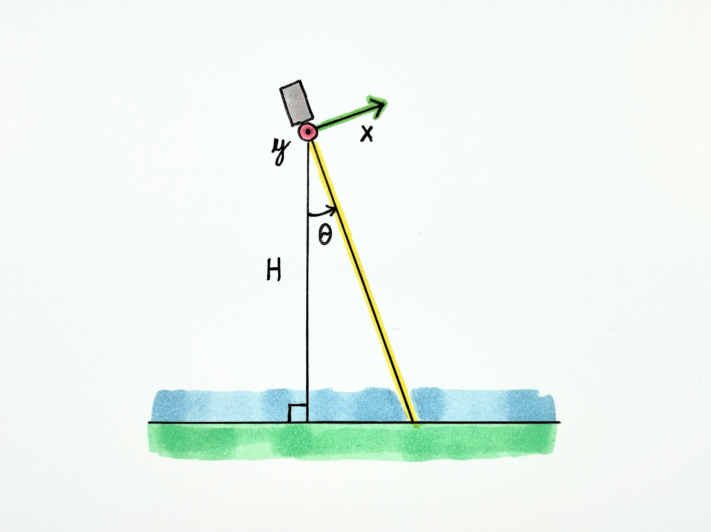
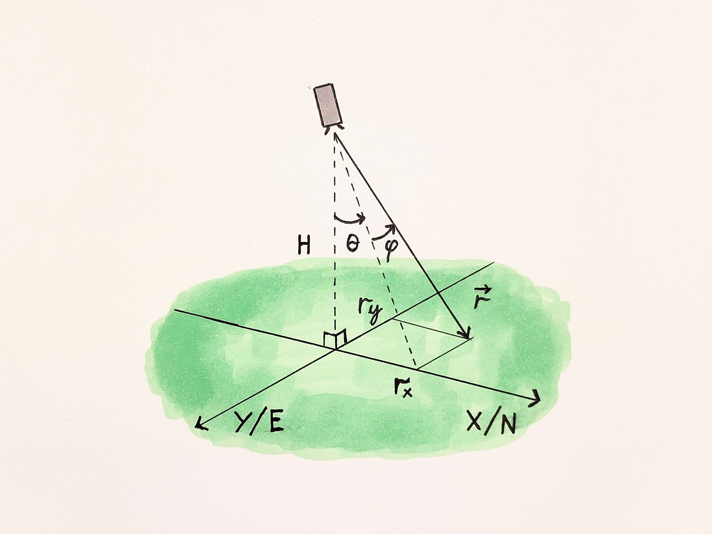

# Camera model and IMU data

## Coordinate system
The orthorectification methods of MassiPipe assume that the camera position and orientation is measured with an IMU, with the following data available:
- Time
- Position (longitude and latitude)
- Camera tilt ("pitch" and "roll")
- Heading (compass direction)

The camera rotation is assumed to follow that of [aircraft principal axes](https://en.wikipedia.org/wiki/Aircraft_principal_axes), i.e. a right-handed coordinate system where

- X axis points forward
- Y axis points right
- Z axis points down

This system is also referred to as "north-east-down" [(NED)](https://en.wikipedia.org/wiki/Axes_conventions#World_reference_frames:_ENU_and_NED). For an initial description of the rotation axes ([Tait-Bryan angles](https://en.wikipedia.org/wiki/Euler_angles#Tait%E2%80%93Bryan_angles)), refer to the airplane image above.

- Roll ($\phi$): Rotation around the X axis, zero at horizontal, positive for "right wing down".
- Pitch ($\theta$): Rotation around the Y axis, zero at horizontal, positive for "nose up".
- Yaw ($\psi$): Rotation around the Z axis, zero at due North, positive for nose right (clockwise seen from above). 

(*[Image](https://commons.wikimedia.org/wiki/File:Yaw_Axis_Corrected.svg): Auawise, Wikimedia Commons*)

Note that while positive pitch is almost always defined as "nose up", in some cases positive roll is defined in the opposite direction of that above, i.e. "right wing **up**". In this case, the sign of the roll angle should be flipped:

$$\phi = - \phi_\text{\ right wing up} $$

## Image pixel matrix
The pushbroom camera captures images line-by-line, and images are displayed with lines stacked horizontally, starting from the top. Image indexing follows the matrix indexing convention, with ($i$,$j$) corresponding to row $i$ and column $j$. The number of rows and columns is denoted $M$ and $N$, respectively. Note that the $x$ axis aligns with the $i$ "axis", i.e. a higher row number corresponds to a position further forward, but that the $y$ axis and the $j$ "axis" point have opposite signs, i.e. a higher column number corresponds to a pixel further to the *left* when seen from above. 

## Looking angle
A pushbroom camera creates an image of the ground by scanning a narrow "line of view" over it. The line of view corresponds to a line of spatial pixels. If we draw a line from the camera to each pixel as imaged on the ground, the line of view corresponds to a planar "fan". Each pixel corresponds to a "looking angle" $\alpha_j$, with $j$ denoting the integer pixel index.   

Images are displayed using the same layout as matrices, using row and column indices. Pixel (0,0) is in the upper left corner, and pixel (M-1, N-1) in the lower right corner. Since the image is formed row-by-row, i.e. from the top and down, the forward direction of the camera corresponds to downwards in the image, and the left direction (Y axis) corresponds to right in the image. 

Assuming a centered fan, we can calculate the looking angle for each pixel based on the camera field of view (FOV). Note that the ordering of pixel indices matches the direction of positive roll.

$$ \alpha_j =  \arctan  \left( -\tan \left( \frac{\text{FOV}}{2} \right) + j \cdot \frac{2 \cdot \tan \left( \frac{\text{FOV}}{2} \right)}{N-1} \right) $$

## Combined looking angle and roll 
When mounting a push-broom camera on a UAV or an airplane, the typical orientation is with the camera pointed straight down and the fan spread out symmetrically "across-track", i.e. parallel to the pitch axis. If the camera and IMU frames of reference are perfectly aligned, the effective roll for a single pixel is given by the sum of the looking angle $\alpha_j$ and the overall camera roll $\phi$. 

$$\phi_{i,j} = \alpha_j + \phi_{\text{IMU},i} $$

## Pitch angle
The effect of non-zero pitch angles is to tilt the image "fan" forward (positive pitch) or backward (negative pitch) relative to [nadir](https://en.wikipedia.org/wiki/Nadir).

# Rotation matrices
We're assuming flat terrain under the camera and we want to calculate the location of each pixel on the ground.  We start with a unit vector pointing towards the center of the camera field of view (along the $x$ axis in the camera frame), and we want to apply a set of rotations to find the direction if this vector in the "world" reference frame (in NED coordinates, north, east and down). By extending the rotated vector until it reaches the ground below, we can calculate the north and east coordinates of the corresponding point on the ground. For simplicity we assume here the camera has "one pixel", and show a more general solution later.   

In general, rotation of a vector in 3D space is performed with a 3x3 matrix,

$$\mathbf{v_\text{rotated}} = R \cdot \mathbf{v} = 
\begin{bmatrix}
    R_{xx} & R_{xy} & R_{xz}\\
    R_{yx} & R_{yy} & R_{yz}\\
    R_{zx} & R_{zy} & R_{zz} 
\end{bmatrix}
\cdot
\begin{bmatrix}
    v_x \\ v_y \\ v_z
\end{bmatrix}
$$

Rotation matrices can be combined to effectively perform multiple rotation in succession. The three angles measured by the IMU (roll $\phi$, pitch $\theta$ and yaw $\psi$) describe three such combined rotations, performed around the $x$, $y$ and $z$ axis, respectively. The rotations are performed with the following three [rotation matrices](https://en.wikipedia.org/wiki/Rotation_matrix#General_3D_rotations):
$$ R_x(\phi)=
\begin{bmatrix}
1 & 0 & 0\\
0 & \cos\phi & -\sin\phi\\
0 & \sin\phi & \cos\phi
\end{bmatrix} $$

$$ R_y(\theta)=
\begin{bmatrix}
\cos\theta & 0 & \sin\theta\\
0 & 1 & 0\\
-\sin\theta & 0 & \cos\theta
\end{bmatrix} $$

$$ R_z(\psi)=
\begin{bmatrix}
\cos\psi & -\sin\psi & 0\\
\sin\psi & \cos\psi & 0\\
0 & 0 & 1
\end{bmatrix}$$

Before the rotations are applied, the coordinate frames of the IMU (the "body") and the "world" are assumed to be aligned. This corresponds to the x-axis pointing forwards and to the north, the y-axis right and to the east, and the z-axis down, towards the center of the earth.  

These matrices are combined to perform an "intrinsic" rotation of any column vector $\mathbf{v} = [x,y,z]^T$ from the IMU frame to the world frame:

$$\mathbf{v}_{\text{world}} = R_z(\psi) R_y(\theta) R_x(\phi) \mathbf{v}_\text{IMU}$$

where the order of operations is read from right to left, i.e. the rotation about the $x$-axis is applied first, then $y$, then $z$. 

# Pixel offsets on the ground - along-track and across-track 
To understand how roll and pitch correspond to across- and alongtrack offsets, we'll first consider the combined rotation around the x and y axes:

$$ 
\begin{align}
 R_y(\theta) R_x(\phi) &=
\begin{bmatrix}
\cos\theta & 0 & \sin\theta\\
0 & 1 & 0\\
-\sin\theta & 0 & \cos\theta
\end{bmatrix} 
\cdot
\begin{bmatrix}
1 & 0 & 0\\
0 & \cos\phi & -\sin\phi\\
0 & \sin\phi & \cos\phi
\end{bmatrix}  \\[20pt]
 &= 
\begin{bmatrix}
\cos\theta & \sin\phi \sin\theta & \cos\phi \sin\theta\\
0 & \cos \phi & -\sin \phi\\
-\sin \theta & \sin \phi \cos \theta & \cos \phi \cos \theta
\end{bmatrix} 
\end{align}
$$

Let's now consider a unit vector $\mathbf{\hat{z}} = [0,0,1]^T$ pointing straight down, i.e. towards the middle of the field of view for the camera, in the case of zero roll and pitch. We can rotate this vector to create a new unit vector $\mathbf{\hat{d}}$ :

$$
\begin{align}
\mathbf{\hat{d}} &= R_y(\theta) \ R_x(\phi) \ \mathbf{\hat{z}} \\
&= R_y(\theta) \ R_x(\phi) \cdot
\begin{bmatrix}
    0 \\ 0 \\ 1 
\end{bmatrix}
&= \begin{bmatrix}
    \cos\phi \sin\theta\\
     -\sin \phi\\
     \cos \phi \cos \theta
\end{bmatrix}
\end{align}
$$

The new unit vector is simply equal to the last column of the combined rotation matrix. If we extend this new unit vector down to the ground below the camera, i.e. to where the z coordinate corresponds to the altitude above ground, $H$, then the $x$ and $y$ coordinates correspond to the along-track and across-track offsets on the ground, respectively.

$$
\mathbf{r} = 
\begin{bmatrix}
    r_x \\ r_y \\ H 
\end{bmatrix} = 
t^* \mathbf{\hat{d}} = 

t^*  
\begin{bmatrix}
    \cos\phi \sin\theta\\
     -\sin \phi\\
     \cos \phi \cos \theta
\end{bmatrix}
$$

The z coordinate lets us solve for the length of the vector, $t^* = \frac{H}{\cos \phi \cos \theta}$. Inserting this into the equation above, we obtain 

$$
\mathbf{r} =
\begin{bmatrix}
    r_x \\ r_y \\ H
\end{bmatrix} = H \cdot 
\begin{bmatrix}
    \frac{\cos\phi \sin\theta}{\cos \phi \cos \theta}\\[8pt]
    \frac{-\sin \phi}{\cos \phi \cos \theta}\\[6pt]
    1
\end{bmatrix} = H \cdot
\begin{bmatrix}
    \tan \theta\\[4pt]
    \frac{-\tan \phi}{\cos \theta}\\[6pt]
    1
\end{bmatrix} 
$$

The $r_x$ and $r_y$ values thus correspond to the along-track and across-track pixel offsets on the ground, respectively. The result matches our intuition:

- A positive pitch $\theta$ tilts the whole fan forwards, i.e. it results in a positive along-track offset $r_x$.
- A positive roll $\phi$ tilts the whole fan in to the left, i.e., across-track offset $r_y$ is negative. The term $\cos \theta$ in the denominator is always positive for a down-looking camera, and accounts for the fact that when the fan is tilted forwards or backwards (non-zero pitch), the rays of the fan spread out more before they intersect the ground plane.  

# Including looking angles and orientation offsets
There are two practical issues that can both be included as rotation matrices:

- Individual pixels correspond to different "looking angles" in the camera reference frame, as mentioned above.
- The camera and the IMU may not be perfectly aligned.

These can be included in a chain of rotations, from the camera to the world frame. In the expression below, subscripts $i$ and $j$ correspond to the image row and column. 

$$ R_{\text{world}\leftarrow\text{pixel},ij} = 
R_{\text{world}\leftarrow\text{IMU},i} \cdot
R_{\text{IMU}\leftarrow\text{camera}} \cdot
R_{\text{camera}\leftarrow\text{pixel},j}
$$

The $R_{\text{camera}\leftarrow\text{pixel},j}$ matrix corresponds to a simple rotation around the $x$ axis to account for the looking angles $\alpha_j$:

$$R_{\text{camera}\leftarrow\text{pixel},j} = R_x(\alpha_j)$$ 

The $R_{\text{IMU}\leftarrow\text{camera}}$ matrix corresponds to the "offset" between camera and IMU frames. This needs to be measured or estimated (sometimes called "boresight calibration"). 

Finally, $R_{\text{world}\leftarrow\text{IMU},i}$ corresponds to the roll, pitch and yaw rotations presented previously.

$$R_{\text{world}\leftarrow\text{IMU},i} = R_z(\psi_i) R_y(\theta_i) R_x(\phi_i) $$

# Pixel coordinates on the ground - general
To calculate the ground position of a pixel based on a combined rotation matrix $R_{\text{world}\leftarrow\text{pixel}}$, we follow the same procedure as in the section on along- and across-track offsets. A downward-pointing unit vector $\hat{\mathbf{z}}$ in the camera (pixel) frame is rotated to a direction unit vector $\hat{\mathbf{d}}$ in the world frame.

$$
\begin{align}
\hat{\mathbf{d}} &= R_{\text{world}\leftarrow\text{pixel}} \hat{\mathbf{z}} \\
&=
\begin{bmatrix}
    R_{xx} & R_{xy} & R_{xz}\\
    R_{yx} & R_{yy} & R_{yz}\\
    R_{zx} & R_{zy} & R_{zz} 
\end{bmatrix} \cdot 
\begin{bmatrix}
    0 \\ 0 \\ 1 
\end{bmatrix} = 
\begin{bmatrix}
    R_{xz} \\ R_{yz} \\ R_{zz} 
\end{bmatrix} 
\end{align}
$$

The direction vector is extended until it reaches the ground via parameterization, $\mathbf{d} = t^* \hat{\mathbf{d}}$. We can then use the $z$ component, corresponding to altitude above ground, to solve for $t^*$

$$ t^* = \frac{H}{R_{zz}}$$

and this gives us an expression for the vector $\mathbf{d}$ from the camera to the ground.

$$ 
\mathbf{d} = 
\frac{H}{R_{zz}} 
\begin{bmatrix}
    R_{xz} \\ R_{yz} \\ R_{zz} 
\end{bmatrix}   
$$

The coordinates of the camera are denoted $\mathbf{r}_\text{camera} = [N,E,0]^T$, where $N$ and $E$ denote northing and easting. The $z$ coordinate of the camera is zero by definition. We combine the camera position with the ray vector $\mathbf{d}$ to get the position of the pixel in world coordinates:

$$
\begin{align}
\mathbf{r}_\text{pixel} &= \mathbf{r}_\text{camera} + \mathbf{d} \\
&= 
\begin{bmatrix} N \\ E \\ 0 \end{bmatrix} + \frac{H}{R_{zz}} 
\begin{bmatrix}
    R_{xz} \\ R_{yz} \\ R_{zz} 
\end{bmatrix} 
\end{align}
$$

This is repeated for every pixel $(i,j)$. We can highlight this by adding subscripts to the vector equation above:

$$
\mathbf{r}_{\text{pixel},ij} = \mathbf{r}_{\text{camera},i} + \mathbf{d}_{ij} 
$$
