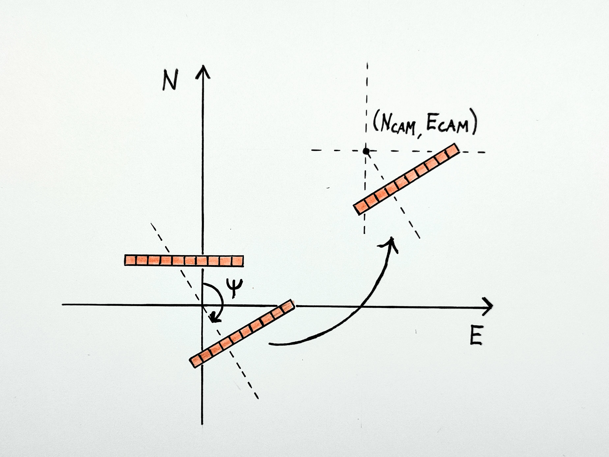
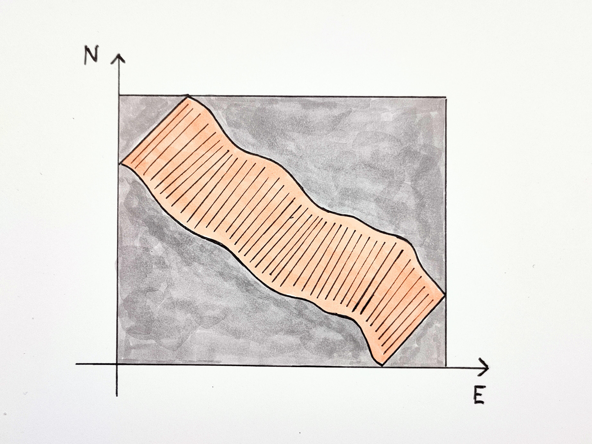

# Camera model and IMU data

## Coordinate system
The orthorectification methods of MassiPipe assume that the camera position and orientation is measured with an IMU, with the following data available:
- Time
- Position (longitude and latitude)
- Camera tilt ("pitch" and "roll")
- Heading (compass direction)

The camera rotation is assumed to follow that of [aircraft principal axes](https://en.wikipedia.org/wiki/Aircraft_principal_axes), i.e. a right-handed coordinate system where

- X axis points forward
- Y axis points right
- Z axis points down

This system is also referred to as "north-east-down" [(NED)](https://en.wikipedia.org/wiki/Axes_conventions#World_reference_frames:_ENU_and_NED). For an initial description of the rotation axes ([Tait-Bryan angles](https://en.wikipedia.org/wiki/Euler_angles#Tait%E2%80%93Bryan_angles)), refer to the airplane image above.

- Roll ($\phi$): Rotation around the X axis, zero at horizontal, positive for "right wing down".
- Pitch ($\theta$): Rotation around the Y axis, zero at horizontal, positive for "nose up".
- Yaw ($\psi$): Rotation around the Z axis, zero at due North, positive for nose right (clockwise seen from above). 

(*[Image](https://commons.wikimedia.org/wiki/File:Yaw_Axis_Corrected.svg): Auawise, Wikimedia Commons*)

Note that while positive pitch is almost always defined as "nose up", in some cases positive roll is defined in the opposite direction of that above, i.e. "right wing **up**". In this case, the sign of the roll angle should be flipped:

$$\phi = - \phi_\text{\ right wing up} $$

## Image pixel matrix
The pushbroom camera captures images line-by-line, and images are displayed with lines stacked horizontally, starting from the top. Image indexing follows the matrix indexing convention, with ($i$,$j$) corresponding to row $i$ and column $j$. The number of rows and columns is denoted $M$ and $N$, respectively. Note that the $x$ axis aligns with the $i$ "axis", i.e. a higher row number corresponds to a position further forward, but that the $y$ axis and the $j$ "axis" point have opposite signs, i.e. a higher column number corresponds to a pixel further to the *left* when seen from above. 

## Looking angle
A pushbroom camera creates an image of the ground by scanning a narrow "line of view" over it. The line of view corresponds to a line of spatial pixels. If we draw a line from the camera to each pixel as imaged on the ground, the line of view corresponds to a planar "fan". Each pixel corresponds to a "looking angle" $\alpha_j$, with $j$ denoting the integer pixel index.   

Images are displayed using the same layout as matrices, using row and column indices. Pixel (0,0) is in the upper left corner, and pixel (M-1, N-1) in the lower right corner. Since the image is formed row-by-row, i.e. from the top and down, the forward direction of the camera corresponds to downwards in the image, and the left direction (Y axis) corresponds to right in the image. 

Assuming a centered fan, we can calculate the looking angle for each pixel based on the camera field of view (FOV). Note that the ordering of pixel indices matches the direction of positive roll.

$$ \alpha_j =  \arctan  \left( -\tan \left( \frac{\text{FOV}}{2} \right) + j \cdot \frac{2 \cdot \tan \left( \frac{\text{FOV}}{2} \right)}{N-1} \right) $$

## Combined looking angle and roll 
When mounting a push-broom camera on a UAV or an airplane, the typical orientation is with the camera pointed straight down and the fan spread out symmetrically "across-track", i.e. parallel to the pitch axis. The effective roll for a single pixel is given by the sum of the looking angle $\alpha_j$ and the overall camera roll $\phi$. 

$$\phi_{i,j} = \alpha_j + \phi_{\text{IMU},i} $$

## Pitch angle
The effect of non-zero pitch angles is to tilt the image "fan" forward (positive pitch) or backward (negative pitch) relative to [nadir](https://en.wikipedia.org/wiki/Nadir).

# Calculating relative pixel offsets on the ground 
We're assuming flat terrain under the camera and we want to calculate the location of each pixel on the ground.  We start with a unit vector pointing towards nadir, i.e. straight down, and we rotate the vector according to roll $\phi_{i,j}$, pitch $\theta_i$ and yaw $\psi_i$ for each pixel $(i,j)$. By extendig this vector until it reaches the ground below, we can calculate the coordinates of the pixel on the ground. To avoid clutter we don't include the $(i,j)$ indices in the derivation below. 

Rotation is performed with three [rotation matrices](https://en.wikipedia.org/wiki/Rotation_matrix#General_3D_rotations):
$$ R_x(\phi)=
\begin{bmatrix}
1 & 0 & 0\\
0 & \cos\phi & -\sin\phi\\
0 & \sin\phi & \cos\phi
\end{bmatrix} $$

$$ R_y(\theta)=
\begin{bmatrix}
\cos\theta & 0 & \sin\theta\\
0 & 1 & 0\\
-\sin\theta & 0 & \cos\theta
\end{bmatrix} $$

$$ R_z(\psi)=
\begin{bmatrix}
\cos\psi & -\sin\psi & 0\\
\sin\psi & \cos\psi & 0\\
0 & 0 & 1
\end{bmatrix}$$

These matrices are combined to perform an "intrinsic" rotation of any column vector $\mathbf{v} = [x,y,z]^T$:

$$\mathbf{v}_{\text{rotated}} = R_z(\psi) R_y(\theta) R_x(\phi) \mathbf{v}$$

where the order of operations is read from right to left, i.e. the rotation about the $x$-axis is applied first, then $y$, then $z$. We'll consider the combined rotation around the x and y axes first:

$$ 
\begin{align}
 R_y(\theta) R_x(\phi) &=
\begin{bmatrix}
\cos\theta & 0 & \sin\theta\\
0 & 1 & 0\\
-\sin\theta & 0 & \cos\theta
\end{bmatrix} 
\cdot
\begin{bmatrix}
1 & 0 & 0\\
0 & \cos\phi & -\sin\phi\\
0 & \sin\phi & \cos\phi
\end{bmatrix}  \\[20pt]
 &= 
\begin{bmatrix}
\cos\theta & \sin\phi \sin\theta & \cos\phi \sin\theta\\
0 & \cos \phi & -\sin \phi\\
-\sin \theta & \sin \phi \cos \theta & \cos \phi \cos \theta
\end{bmatrix} 
\end{align}
$$

Let's now consider a unit vector $\mathbf{\hat{z}} = [0,0,1]^T$ pointing straight down, i.e. towards the middle of the field of view for the camera, in the case of zero roll and pitch. We can rotate this vector to create a new unit vector $\mathbf{\hat{r}}$ :

$$
\begin{align}
\mathbf{\hat{r}} &= R_y(\theta) \ R_x(\phi) \ \mathbf{\hat{z}} \\
&= R_y(\theta) \ R_x(\phi) \cdot
\begin{bmatrix}
    0 \\ 0 \\ 1 
\end{bmatrix}
&= \begin{bmatrix}
    \cos\phi \sin\theta\\
     -\sin \phi\\
     \cos \phi \cos \theta
\end{bmatrix}
\end{align}
$$

The new unit vector is simply equal to the last column of the combined rotation matrix. If we extend this new unit vector down to the ground below the camera, i.e. to where the z coordinate corresponds to the altitude above ground, $H$, then the $x$ and $y$ coordinates correspond to the along-track and across-track offsets on the ground, respectively.

$$
\mathbf{r} = 
\begin{bmatrix}
    r_x \\ r_y \\ H 
\end{bmatrix} = 
\|\mathbf{r}\| \cdot 
\begin{bmatrix}
    \cos\phi \sin\theta\\
     -\sin \phi\\
     \cos \phi \cos \theta
\end{bmatrix}
$$

The z coordinate lets us solve for the length of the vector, $\|\mathbf{r}\| = \frac{H}{\cos \phi \cos \theta}$. Inserting this into the equation above, and only including $x$ and $y$ coordinates, we obtain 

$$
\mathbf{r_{xy}} =
\begin{bmatrix}
    r_x \\ r_y 
\end{bmatrix} = H \cdot 
\begin{bmatrix}
    \frac{\cos\phi \sin\theta}{\cos \phi \cos \theta}\\[8pt]
    \frac{-\sin \phi}{\cos \phi \cos \theta}\\
\end{bmatrix} = H \cdot
\begin{bmatrix}
    \tan \theta\\[4pt]
    \frac{-\tan \phi}{\cos \theta}\\
\end{bmatrix} 
$$

The $\mathbf{r_{xy}}$ vector thus corresponds to the pixel offsets on the ground. The result matches our intuition when we consider tilting the push-broom "fan". (Remember that the $x$ axis points forward and the $y$ axis points to the right.)  

- A positive pitch $\theta$ tilts the whole fan forwards, i.e. along-track offset $r_x$ is positive.
- A positive roll $\phi$ tilts the whole fan in to the left, i.e., across-track offset $r_y$ is negative. The term $\cos \theta$ in the denominator accounts for the fact that when the fan is tilted forwards or backwards (non-zero pitch), the rays of the fan spread out more before they intersect the ground plane.  

# Calculating pixel positions in the world reference frame
To calculate the absolute position of a pixel we need to take into account the position and heading of the camera. We assume that the position is measured as northing $N_{\text{cam}}$ and easting $E_{\text{cam}}$, and that heading $\psi$ is a standard compass angle, measured clockwise relative to north. 

The pixel offset vector $\mathbf{r_{xy}}$ can be rotated to the correct heading via the general $R_z(\psi)$ matrix listed above. We redefine $R_z(\psi)$ here to only include x and y coordinates: 

$$
\mathbf{r_{xy,\text{rot}}} = 
R_{z}(\psi) \cdot  \mathbf{r_{xy}} = 
\begin{bmatrix}
\cos\psi & -\sin\psi \\
\sin\psi & \cos\psi
\end{bmatrix} \cdot 
\mathbf{r_{xy}}
$$

By adding the camera positions to the relative offsets, we get the an expression for the pixel location in absolute units of northing $N$ and easting $E$. 

$$
\begin{bmatrix}
    N \\ E  
\end{bmatrix} = 
\begin{bmatrix}
    N_{\text{cam}} \\ E_{\text{cam}}  
\end{bmatrix} +  
R_{z}(\psi) \cdot  \mathbf{r_{xy}}
$$

## "Boresight" angle offsets
There is often a small, constant offset between the true rotation angles angles and those measured by the IMU. These offsets can be measured, a process sometimes called "boresight calibration", and be applied as an additional rotation to correct the IMU measurements. 

$$R_\text{camera} = R_\text{boresight} \cdot R_\text{IMU}$$

The boresight rotation follows the same general rotation matrix definition (and order) as defined above.

# Using broadcasting to calculate coordinates for every pixel

Camera position and rotation measurements are stored in arrays with the following dimensions, where $M$ denotes number of image rows and $N$ denotes number of image columns:

| Measurement           | Shape     |
|-----------------------|-----------|
| $N_\text{cam}$        | (M,)      |
| $E_\text{cam}$        | (M,)      |
| H                     | (M,)      |
| $\psi$                | (M,)      |
| $\theta$              | (M,)      |
| $\phi$                | (M,N)     |

We can construct a tensor containing all the pixel offsets $r_{xy}$, 
    
    r_xy = np.empty((M, 2, N))
    r_xy[:, 0, :] =  np.tan(theta)[:, None]                  # Northing
    r_xy[:, 1, :] = -np.tan(phi) / np.cos(theta)[:, None]    # Easting
    r_xy *= H[:, None, None]                                 # Scale by altitude

and a corresponding tensor with $M$ rotation matrices (one for each yaw angle),

    R_z = np.empty((M, 2, 2))
    R_z[:, 0, 0] =  np.cos(psi)
    R_z[:, 0, 1] = -np.sin(psi)
    R_z[:, 1, 0] =  np.sin(psi)
    R_z[:, 1, 1] =  np.cos(psi)

Finally, we can also stack camera northing and easting into a 3D tensor:

    NE_cam = np.stack([N_cam, E_cam], axis=1)   # (M, 2)
    NE_cam = NE_cam[:, None, :]                 # (M, 1, 2)

These three tensors have shapes that are suitable for matrix multiplication and broadcasting :

| Tensor      | Shape   |
|-------------|---------|
| `r`         | (M,2,N) | 
| `R_z`       | (M,2,2) |
| `NE_cam`    | (M,2,N) |

Pixel positions can now be calculated as
    
    NE_pix = NE_cam + R_z @ r          # (M,2,2) @ (M,2,N) => (M,2,N)
    NE_pix = NE_pix.transpose(0,2,1)   # (M,N,2)

# Resampling to regular grid
If the movement of the camera is slightly irregular due to movement of the camera platform, the "swath" the the camera images on the ground also becomes irregular. To make an orthorectified image, the swath needs to be resampled into a regular grid, typically one aligned with the northing and easting axes. The figure below illustrates this: The orange swath has a rectangular "bounding box" which defines the extent of the regular grid. Values inside the swath are resampled to the grid using nearest-neigbor resampling (preserving shapes of original spectra), while values outside (gray in figure) are marked as "no data".

